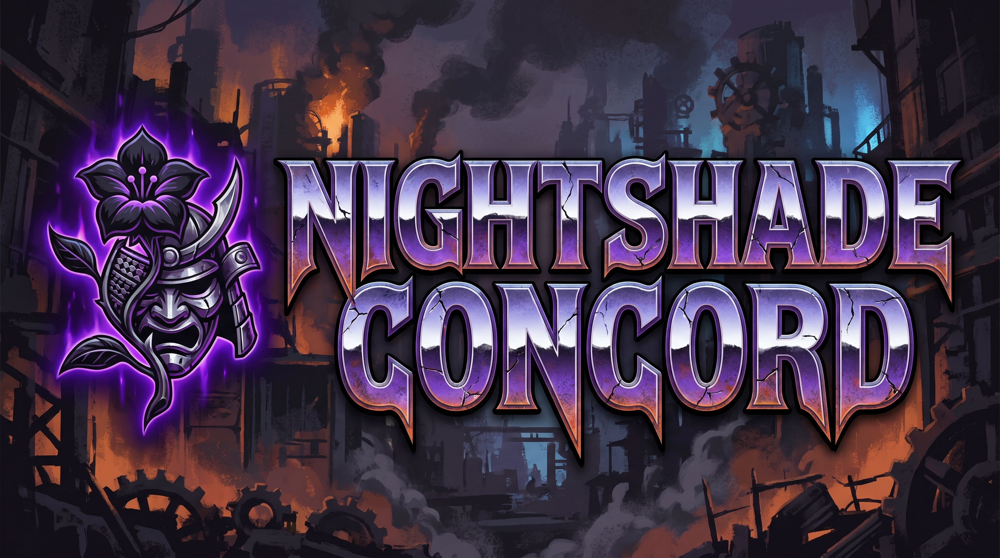
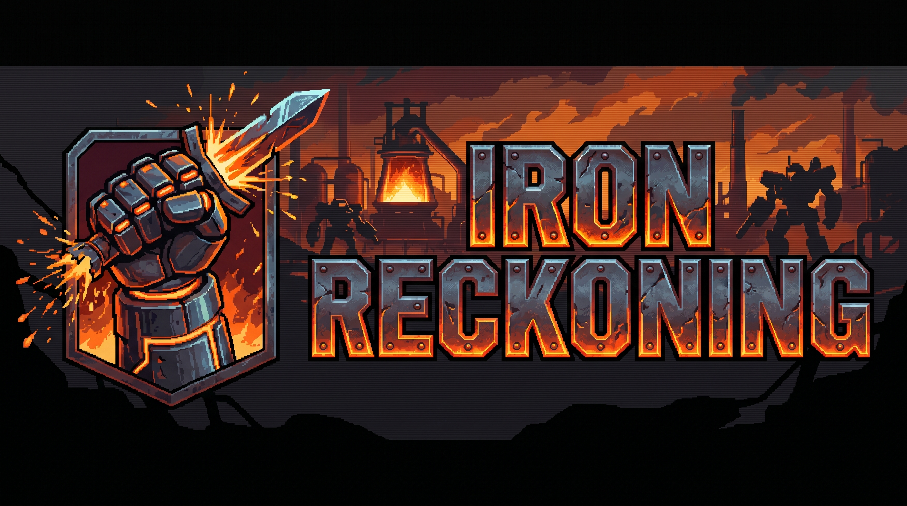

<div align="center">

# ⚔️ OpenOMF — Nightshade Edition

**A story-driven expansion fork of [OpenOMF](https://github.com/omf2097/openomf), the open-source remake of _One Must Fall: 2097_.**

Two original narrative tournaments · a cast of familiar fighters turned conspirators · optional HD textures · quality-of-life fixes · a drop-in test pilot.


</div>

> [!NOTE]
> This is an **unofficial, non-profit fan project**. It is not affiliated with or
> endorsed by the OpenOMF team, Diversions Entertainment, or Epic MegaGames.
> All original-game data is freeware and is **not** redistributed here.
> See [Acknowledgements & Credits](#-acknowledgements--credits).

---

## 📜 Table of contents

- [What is this?](#-what-is-this)
- [Features at a glance](#-features-at-a-glance)
- [The story](#-the-story)
- [The fighters](#-the-fighters)
- [Quick start](#-quick-start)
- [Playing the expansion](#-playing-the-expansion)
- [Game data](#-game-data)
- [How it was built](#-how-it-was-built)
- [Acknowledgements & Credits](#-acknowledgements--credits)
- [License](#-license)

---

## 🌃 What is this?

*One Must Fall: 2097* is a 1994 robot-fighting classic. **OpenOMF** faithfully
rebuilds its engine for modern systems. **Nightshade Edition** sits on top of
that engine and adds a self-contained **single-player story campaign**: two new
tournaments with an original revenge plot, told through the game's own
pre-fight taunts and victory cutscenes — and written so the hero is **you**, by
whatever name you choose.

Nothing about the base game is removed. The expansion is additive: drop-in
tournament files, an optional texture mod, and a couple of small, isolated
engine tweaks (documented in [CHANGES.md](CHANGES.md)).

---

## ✨ Features at a glance

- 🗡️ **Two brand-new tournaments** — *Nightshade Concord* and *Iron Reckoning* — with an original, connected revenge story.
- 🎭 **A familiar cast, recast** — the classic OMF pilots return as members of a sinister fight-cult, plus a brand-new masked villain, **Vance**.
- 🧑 **Your name, your story** — every taunt and cutscene line uses your chosen pilot name and is **fully gender-neutral**. No hardcoded hero.
- 🖼️ **Custom title art** — hand-generated banners baked into each tournament's select screen.
- 🎨 **Optional HD textures** — one-command integration of the community [HD Remaster mod](https://github.com/omf2097/openomf-hdremaster-mod) (RGBA art auto-converted to the engine's format).
- 🖥️ **True fullscreen at any resolution** — borderless-desktop mode that scales cleanly instead of forcing a display-mode switch.
- 🚀 **Pick up and play** — a bundled `CHAMPION` save (maxed Jaguar, 200,000 cr) lets you jump straight into the new content.
- 🔁 **Reproducible** — a single `build-expansion.sh` regenerates everything from source using the engine's own data tools.

---

## 🎬 The story

> A mentor murdered. A medal returned in an unmarked box. Beneath the legitimate
> circuit festers a fight-cult that rigs arenas and collects pilots — and it
> answers to a masked king.

You are a pilot hunting the people who killed the one who trained you. The plot
unfolds **across the fights**: each opponent's pre-fight taunt drops another
clue, and a multi-page victory cutscene pays it off.

### Tournament I — *Nightshade Concord*
<div align="center">



</div>

Infiltrate the **Nightshade Concord** and climb through its enforcers to reach
the masked leader, **Vance**, and learn who really ordered the killing.
**Entry fee: 15,000 cr.**

### Tournament II — *Iron Reckoning*
<div align="center">



</div>

The Concord is broken, but its **patron** survives — a financier "in a green
machine" who bankrolled every shadow you cut down. The survivors return in
deadlier prototype mechs for the circuit's hardest gauntlet, and a hidden hand
tied to the original game's legacy waits at the end. **Entry fee: 25,000 cr.**

Both tournaments are tuned to the **post-World-Championship** power band: hard,
but fair for an upgraded HAR.

---

## 🤖 The fighters

The conspiracy is staffed by the pilots you know — each one re-imagined as a
Concord member, escalating toward the boss.

**Nightshade Concord** (in fighting order):

| # | Pilot | Mech (HAR) | Role |
|---|-------|-----------|------|
| 1 | Cossette | Katana | Initiate |
| 2 | Milano | Jaguar | Runner |
| 3 | Jean-Paul | Electra | Collector |
| 4 | Christian | Thorn | Enforcer |
| 5 | Angel | Pyros | True believer |
| 6 | Ibrahim | Gargoyle | The Mountain |
| 7 | Shirro | Shredder | The Hand |
| 8 | Raven | Shadow | The Whisper |
| ★ | **Vance** | Nova | **Masked leader** (gated boss) |

**Iron Reckoning** brings the same names back in new, deadlier mechs (Chronos,
Flail, Pyros, Katana, Gargoyle, Thorn, Nova, Shadow…) and ends with a secret
patron as the final boss.

---

## 🚀 Quick start

> Requires the freeware OMF:2097 data files — see [Game data](#-game-data).

### macOS / Linux
```bash
# 1. Build the engine
mkdir -p build && cd build
cmake -DCMAKE_BUILD_TYPE=Release ..
make -j
cd ..

# 2. Build + install the expansion (tournaments, HD mod, test pilot)
./build-expansion.sh

# 3. Play
./play.sh
```

Dependencies and platform notes are in [BUILD.md](BUILD.md).

---

## 🎮 Playing the expansion

- **Load Game → `CHAMPION`** — a ready-made pilot with a fully-upgraded Jaguar
  and 200,000 cr. *Or* create a new pilot and name them anything — the story
  adapts to the name.
- **Mechlab → Select Tournament** — pick **Nightshade Concord** or
  **Iron Reckoning**.
- Win every ranked fight to unlock the gated boss, then advance the victory
  cutscene with **Punch / Kick**.
- **Fullscreen:** Main Menu → Configuration → Video → **Fullscreen On** (enable
  *aspect ratio* to avoid stretching). It fills the screen at any resolution.

---

## 💾 Game data

OpenOMF loads the original *One Must Fall: 2097* data files. OMF:2097 is
**freeware** — download the assets from
[omf2097.com](https://www.omf2097.com/pub/files/omf/openomf-assets.zip) and
place the `OMF2097/` contents in your resources directory (see
[PATHS.md](PATHS.md)). These files are intentionally **not** included in this
repository.

---

## 🛠️ How it was built

The expansion is generated by small tools that link the engine's **own** data
library, so the output is always byte-correct:

- `tools/expansion/gen.c` — builds the two `.TRN` tournaments (roster, mechs,
  gender-neutral story, and the custom title banners baked into the tournament
  palette/sprite).
- `tools/expansion/mkpilot.c` — builds the ready-to-play `CHAMPION` savegame.
- `tools/expansion/hdmod_pack.py` — converts the HD Remaster RGBA art to the
  engine's indexed format and packages a loadable mod.
- `build-expansion.sh` — one command to do all of the above.

Full design notes: [EXPANSION-KYRA.md](EXPANSION-KYRA.md). Diff vs. vanilla:
[CHANGES.md](CHANGES.md).

---

## 🙏 Acknowledgements & Credits

**This project stands entirely on the shoulders of the people who made the
original game and its open-source revival. All credit for the engine, the
fighters, the world, and the feel of OMF belongs to them.**

- 🕹️ **One Must Fall: 2097** — created by **Diversions Entertainment** and
  published by **Epic MegaGames** (1994). One of the all-time great PC fighters,
  generously released as freeware. This expansion is a love letter to it.
- 🔧 **OpenOMF** — the open-source engine this fork is built on, by
  **Tuomas Virtanen (katajakasa)**, **Andrew Thompson**, **Hunter**, and the
  OpenOMF contributors. Without their years of reverse-engineering and rebuilding,
  none of this would exist. → <https://github.com/omf2097/openomf>
- 🎨 **OpenOMF HD Remaster mod** — community HD art by the
  [openomf-hdremaster-mod](https://github.com/omf2097/openomf-hdremaster-mod)
  authors (optional; fetched at build time, not redistributed here).

The upstream OpenOMF README is preserved verbatim as
[README.upstream.md](README.upstream.md).

If you enjoy this, please go **star [OpenOMF](https://github.com/omf2097/openomf)**
and join their [Discord](https://discord.gg/7CPPzab) — support the project that
makes it all possible.

---

## 📄 License

Released under the **MIT License** — the same as upstream OpenOMF — see
[LICENSE](LICENSE).

This is a **non-profit fan project**: distributed free of charge, and **never to
be sold**. Bundled third-party components retain their own licenses (see the
[upstream README](README.upstream.md)). The expansion content, tools, and docs
added by this fork are released under the same MIT terms.

<div align="center">

*Made with respect for a classic. ⚙️*

</div>
